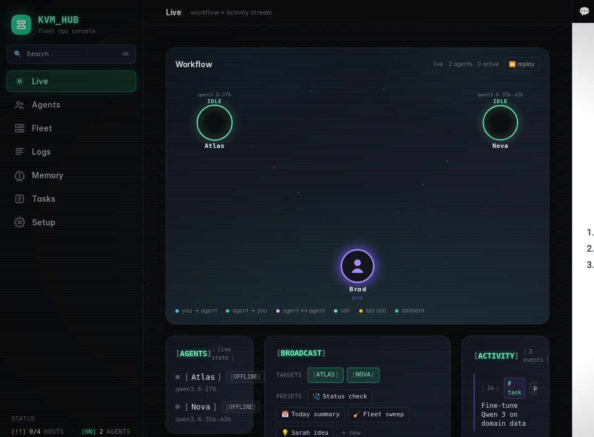
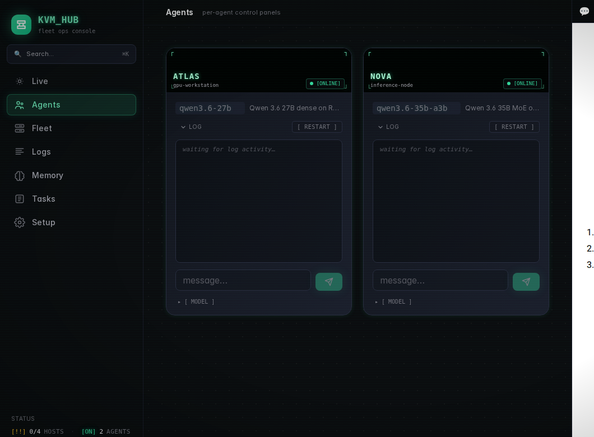
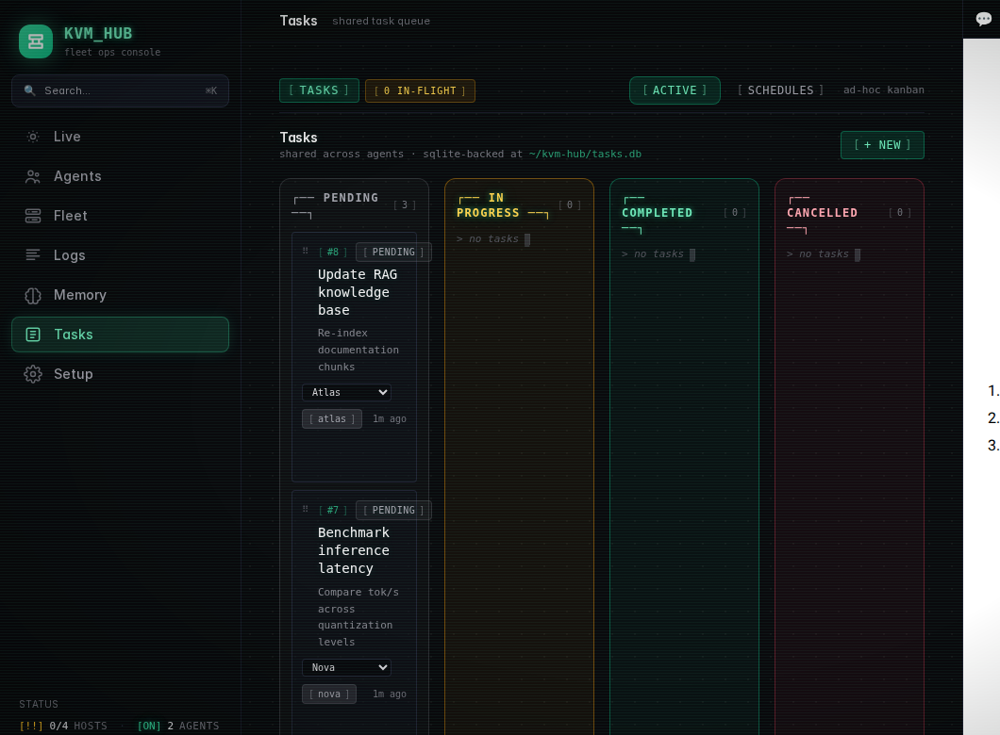
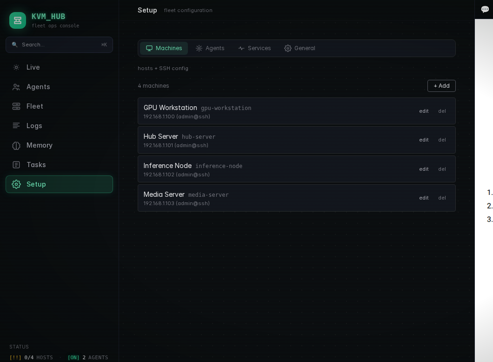

# KVM Hub

Fleet operations dashboard for managing machines, AI agents, and services from a single UI. Built for homelabs and small GPU clusters running local LLMs.









## What it does

- **Live view** — real-time workflow graph showing agent-to-agent interactions, activity feed, broadcast messaging
- **Agent panels** — per-agent control with metrics, log tailing, chat, model inspection, performance tracking
- **Fleet management** — hardware stats, GPU monitoring, systemd/Docker service health, Wake-on-LAN, ping matrix
- **Task board** — kanban with drag-and-drop, agent assignment, cron/schedule viewer
- **Memory** — Honcho integration for shared agent memory, semantic search across sessions
- **Setup wizard** — configure machines, agents, and services through the UI
- **Embedded Telegram** — self-hosted tweb client for messaging agents without leaving the dashboard
- **Command palette** — `Cmd+K` launcher for quick actions across the entire dashboard

## Stack

- **Frontend:** React + TypeScript + Tailwind CSS (Vite)
- **Backend:** Python FastAPI + SQLite
- **Styling:** Terminal/phosphor aesthetic, dark mode, PWA-ready

## Quick start

```bash
# Clone
git clone https://github.com/MillsAirCode/kvm-hub.git
cd kvm-hub

# Backend
cd api
python3 -m venv venv && source venv/bin/activate
pip install fastapi uvicorn pyyaml wakeonlan httpx
cd ..

# Frontend
cd dashboard
npm install && npm run build
cd ..

# Configure your fleet
cp machines.example.yaml machines.yaml
cp agents.example.yaml agents.yaml
cp services.example.yaml services.yaml
# Edit each file with your machines, agents, and services

# Run
cd api && python3 main.py
```

Open the URL printed at startup. On first load you'll be prompted for the API key (auto-generated at `.api_key`).

## Configuration

KVM Hub reads fleet configuration from three YAML files in the project root:

| File | Purpose |
|------|---------|
| `machines.yaml` | Hosts — IP, SSH credentials, MAC for Wake-on-LAN |
| `agents.yaml` | LLM agents — model, endpoints, log paths, Telegram relay |
| `services.yaml` | Services to monitor — systemd units, Docker containers |

Copy the `.example.yaml` files and customize. You can also manage these through the **Setup** tab in the dashboard UI.

### Environment variables

| Variable | Default | Description |
|----------|---------|-------------|
| `KVM_HUB_HOST` | `0.0.0.0` | Bind address |
| `KVM_HUB_PORT` | `8090` | Bind port |
| `KVM_HUB_TLS_CERT` | — | Path to TLS certificate (for HTTPS) |
| `KVM_HUB_TLS_KEY` | — | Path to TLS private key |
| `KVMHUB_API_KEY` | auto-generated | API key (or reads from `.api_key` file) |
| `HONCHO_BASE` | `http://localhost:8000` | Honcho memory API URL |
| `HONCHO_WORKSPACE` | `hermes` | Honcho workspace name |
| `TWEB_DIST` | `../tweb/public` | Path to self-hosted tweb build (for embedded Telegram) |
| `KVM_HUB_LOCAL_MACHINE` | — | Machine ID that runs locally (skips SSH for host stats) |
| `HERMES_BIN` | `hermes` | Path to Hermes CLI binary on remote hosts |

### HTTPS with Tailscale

For HTTPS via Tailscale (required if using embedded Telegram):

```bash
sudo tailscale cert $(hostname).your-tailnet.ts.net
# Point KVM_HUB_TLS_CERT and KVM_HUB_TLS_KEY at the generated files
```

## Optional: Guacamole (remote desktop)

The `docker-compose.yml` sets up Apache Guacamole for browser-based SSH/RDP/VNC access to fleet machines. This is optional — the dashboard works without it.

```bash
# Generate a Postgres password
echo "PG_PASSWORD=$(openssl rand -base64 20)" > .env

# Start Guacamole stack
docker compose up -d

# Run initial setup (creates admin password + connections from machines.yaml)
python3 scripts/setup_admin_and_first_connection.py
```

## Optional: Embedded Telegram

The dashboard can embed a self-hosted Telegram web client at `/tg/`. This requires building [tweb](https://github.com/nicedayzhu/nicedayzhu-nicegram-web-z-nicedayzhu) separately:

```bash
cd ../tweb
pnpm install && pnpm build
# The dashboard will serve it from TWEB_DIST
```

## Project structure

```
kvm-hub/
  api/
    main.py           # FastAPI backend (all endpoints)
  dashboard/
    src/              # React components
    dist/             # Built frontend (git-ignored)
  scripts/            # Guacamole setup helpers
  machines.yaml       # Your fleet config (git-ignored)
  agents.yaml         # Your agent config (git-ignored)
  services.yaml       # Your service config (git-ignored)
  *.example.yaml      # Example configs (committed)
  docker-compose.yml  # Optional Guacamole stack
```

## License

MIT
